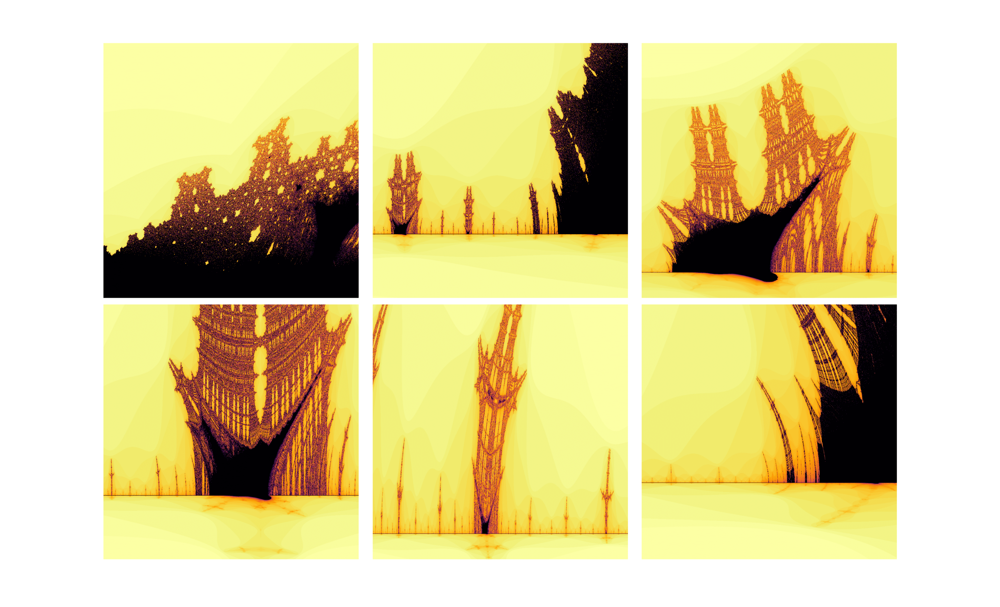

# Fractals

Fractals are constructs with very interesting mathematical properties. By definition, they are self-similar, meaning they exhibit the same style of structure at all scales. Mathematically, these scales go on indefinitely, revealing an infinite realm of finer and finer structure with no limit to how much one can ‘zoom in’ to still see the structures. This iterative property of fractals makes them very interesting to study, aesthetically pleasing to view due to their intricate details and evolving symmetry, and also difficult to characterize in whole due to their complexity.

One of the courses I took at Penn State was ASTRO 527, a graduate level course titled Computational Physics and Astrophysics. For my final project in that course, I explored the numerical generation of mathematical fractals, focusing on the Mandelbrot Set. The rigorous mathematical details of this and related sets are extremely complicated and beyond the scope of what I show here; instead, I resort to a largely qualitative study and aim to reveal the beauty of these structures!

### The Mandelbrot Set

The Mandelbrot set is perhaps the most famous example of a mathematical fractal, and it is defined as the set of complex numbers, C ∈ C, such that the recursive sequence below,

zn+1 = zn2 + C

does not diverge when iterated from z0 = 0. In other words, for a particular value of C, the sequence must remain bounded as n → ∞ for C to be part of the set. Moreover, it can be <a href="https://mrob.com/pub/muency/escaperadius.html">shown</a> that the condition can be reduced, equivalently, to requiring that the magnitude of every term be less than or equal to 2, i.e.:

|zn| ≤ 2, ∀ n ≥ 0

This definition has two implications. First, since the series begins with z0 = 0, this condition implies that the set is bounded in the complex plane, i.e. the entire set is contained in a circle of radius 2 in the complex plane, since any point outside this circle would cause the first iteration to increase the magnitude of z1 greater than two and thus be automatically excluded from the set. Second, this gives us a very convenient way to model the set: instead of picking an arbitrarily large number to consider a sequence unbounded for our purposes, we can just choose the value of 2 to check if a sequence will diverge.

  

  

### The "Burning Ship" fractal

The so-called ‘Burning Ship’ fractal is a very intriguing and closely related mathematical object to the Mandelbrot set. Created and first studied by Michael Michelitsch and Otto Rossler in 1992, it involves a slightly changed calculation of the Mandelbrot set definition. It is the set of C ∈ C such that the sequence

zn+1 = (|Re(zn)| + i|Im(zn)|)2 + C

does not diverge, when also iterated from z0 = 0. In other words, the sequence involves taking the absolute value of the real and imaginary parts separately and then squaring instead of simply squaring as is done for the Mandelbrot set.

  

The resulting fractal, when viewed upside down (flipping of the y-axes), qualitatively resembles an image of a large ship on fire, hence the name ‘burning ship’. The fire-like fractal boundary on the top of the ship is even more apparent when the image is colored to show how quickly various points begin to diverge, as the color gradient resembles flame-like detail.

An even more surprising result of this set is the number of additional ‘ships’ lined up on the ‘horizon’ of the image, with each one appearing at a much smaller scale than the previous. Indeed, this is the hallmark of fractals. The way the ‘ships’ appear to sit on the ‘horizon’ coincident with the real line (i.e. y = Im(C) = 0) to the left of the main ‘ship’ is uncanny.

  

  
