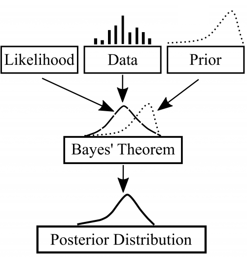
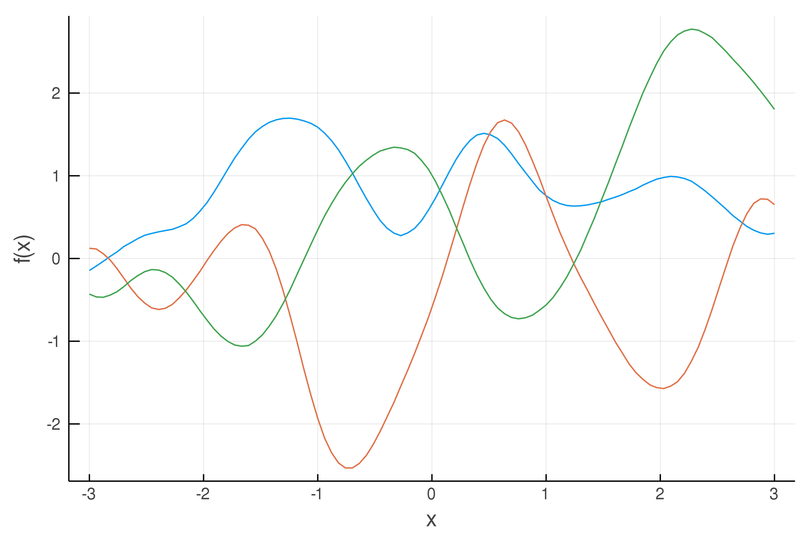
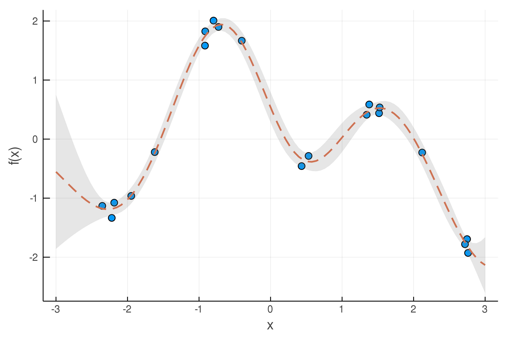

# Gaussian Processes

  

### What is Gaussian process (GP) regression?

Often, we wish to develop a model to predict the output of a function given inputs, based on empirical data. In machine learning, this general problem is called *supervised learning*. You may have heard of the more common term "regression", which just refers to this process for modeling continuous functions ("classification" is the analogous term for problems with discrete outputs).

Most commonly, parametric models are used to fit a dataset if there is a good reason to believe that a certain functional form will describe the data reasonably well. On the other hand, *non-parametric* models do not assume any single functional form, but rather attempt to find a distribution over all possible functions that are consistent with the data. In this way, non-parametric models can be thought of as having an infinite number of "parameters" in the sense that we usually think of a parameter (non-parametric models may also have "hyperparameters", which are different and which we'll get to later).

We typically wish to find the optimal or "best-fit" model parameters (in the case of using parametric models, usually), using methods such as maximum likelihood estimation (MLE). However, instead of simply finding a single set of parameters, the Bayesian approach involves inferring a probability distribution over all the possible values for the model parameters. At the heart of the Bayesian method is Bayes' theorem, which essentially involves starting with a *prior* (initial guess or assumption about the distribution, based on "prior" knowledge hence the term) and using new data points to form the *posterior* (the resulting probability distribution updated based on the data).

  
*Baye's Theorem as a diagram. Image taken from [Towards Data Science](https://towardsdatascience.com/bayesian-statistics-for-data-science-45397ec79c94).*

With that said, **Gaussian process regression** is a non-parametric, Bayesian method that uses Gaussian processes to model data. A Gaussian process is a random process where any finite number of observations have a joint Gaussian distribution. As such, GP's are completely specified by a mean function *m(x)* and a covariance (i.e. kernel) function *k(x,x')*.

  
In other words, given a set of (training) data, a choice of the mean function, and a choice of the kernel function, the GP model is fully defined! The trick with GP regression is in how to choose the mean and kernel functions. The math to make predictions from the GP model (i.e. to compute the posterior distribution from the mean, kernel, and data) is several pages of linear algebra, which are fully described in the [book by Rasmussen and Williams (2006)](http://www.gaussianprocess.org/gpml/).

### What are the mean and kernel functions and how do you choose them?

Part of the flexibility of GP regression comes from the freedom in choosing the mean and kernel functions. Since the mean and kernel functions form the entire GP model (along with the training data, of course), they are a way of specifying the structure of the function you are trying to model. In other words, simply choosing a mean and kernel implies specifying a certain prior distribution over functions. So what exactly do they mean?

**Mean function:**
When I first started learning about GP's, I was surprised at how little information I could find regarding the mean function. Indeed, most of the effort and detail is in the kernel function. Most tutorials will mention simply choosing a zero or constant mean function, and leave it at that. To me, the best way to think about the mean function is to think about what you want the model to do in the absence of any training data. Perhaps you have reason to believe that there is some underlying or asymptotic trend (e.g., linear) in the data and you wish to model the variations around that trend with the GP. Or perhaps you may want the model to be especially "bad" when predicting far from the data (see *How I use GPs in my research* below). Or, most likely, you just wish to let the GP do all the work and don't care what the model returns far away from the data, and choose zero for the mean function.

**Covariance/kernel function:**
The kernel function defines how data points are related to one another. It defines the structure of the GP and thus should be carefully chosen with the known properties of the function (data) you are trying to model in mind. Maybe there is "spiky" behavior in the data you wish to capture with a *Matern* kernel. Or perhaps the process generating the data is periodic, in which case a *Periodic* kernel would be a naturally good choice. Most commonly, you may want a simple, smooth, and infinitely differentiable kernel, in which case you would adopt the standard *Squared Exponential* (SE; also known as the *Radial Basis Function*, or just "*Gaussian*") kernel.

  
Whichever kernel you choose, it will typically have a number of "hyperparameters" that you also need to specify values for. These hyperparameters may be physically interesting, for example the period scale in the Periodic kernel, but often they are more abstract. In the case of the SE kernel, there is a *scale factor* σf and a *length scale* λ. Intuitively, the scale factor controls the strength of correlation between data points, while the length scale defines how far points (in input space) can be before they are uncorrelated. The scale factor also has the effect of controlling the spread in the model prediction far away from any data (in the absence of data, the model returns draws from the prior, which in this case is simply a Gaussian distribution centered around the mean function with a standard deviation equal to the scale factor). The hyperparameters are typically optimized by maximizing the marginal likelihood.

These popular kernels can even be combined, if there are multiple features in the data you wish to model!

  
*Draws from a Gaussian process with a Squared Exponential kernel, with scale factor = 1 and length scale = 0.5. This kernel has the property of smoothness (enforcing points close to each other to be highly correlated).*

  
*An example of GP regression for modeling noisy data (blue circles, with standard deviation = 0.1), using the SE kernel. The dashed line and shaded region denote the mean prediction and uncertainty region of the GP posterior, respectively.*

### How I use GPs in my research

I use GP regression in my [research](https://hematthi.github.io/research/syssim_architectures.html), to model *simulated data* (technically, I use GP's to model how well the simulated models fit the real data, as explained below), as a way of more quickly constraining the parameters of the models. We use [approximate Bayesian computation (ABC)](https://en.wikipedia.org/wiki/Approximate_Bayesian_computation) to constrain the model parameters. This involves specifying a distance function (which quantifies how well the models fit the data) and trying to minimize that function.

While we could perform model inference with ABC without any GP regression, our models are relatively expensive and have many parameters. It would take too long to simulate for millions of different sets of model parameters. Thus, we use GP's to *model the distance function itself*. Since the distance is a function of the model parameters, the "data" in this case is a set of model parameters with known distances (i.e., where we actually simulated the model). In other words, we use GP's to build an **emulator** for our models.
