# Hawaii

## January 3-8, 2020

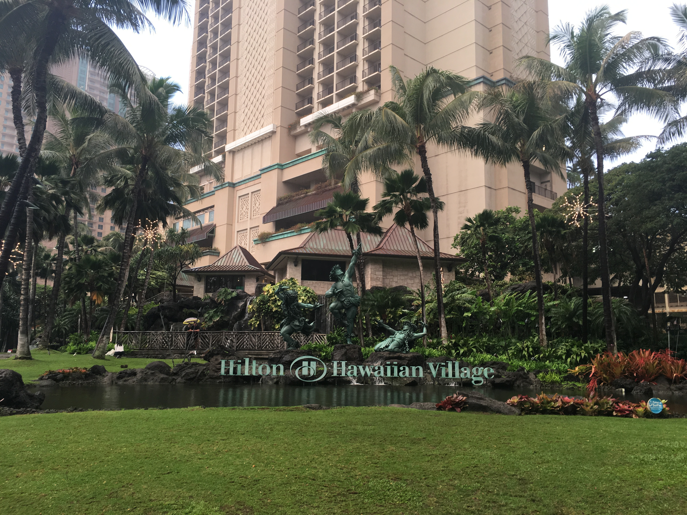
  
Hilton Hawaiian Village, where the ExoPAG 21 meeting was held.

  
Beachside pool in the Hilton Hawaiian Village.

  
Palm trees near the Hilton Hawaiian Village.

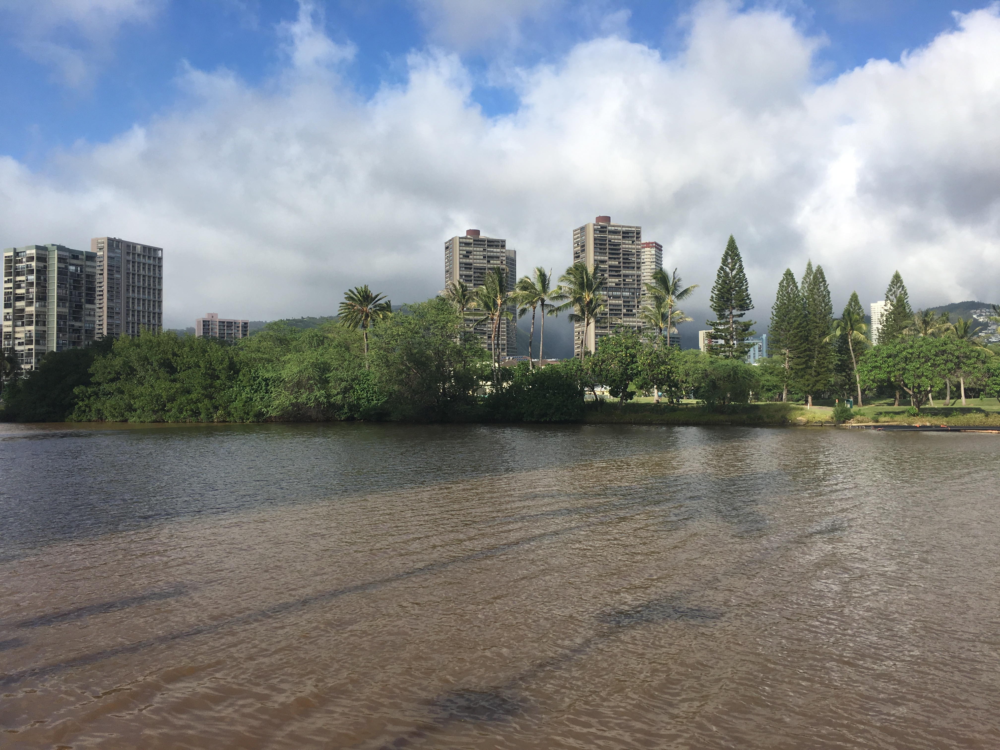
  
View inland of Honolulu, across the canal from Waikiki.

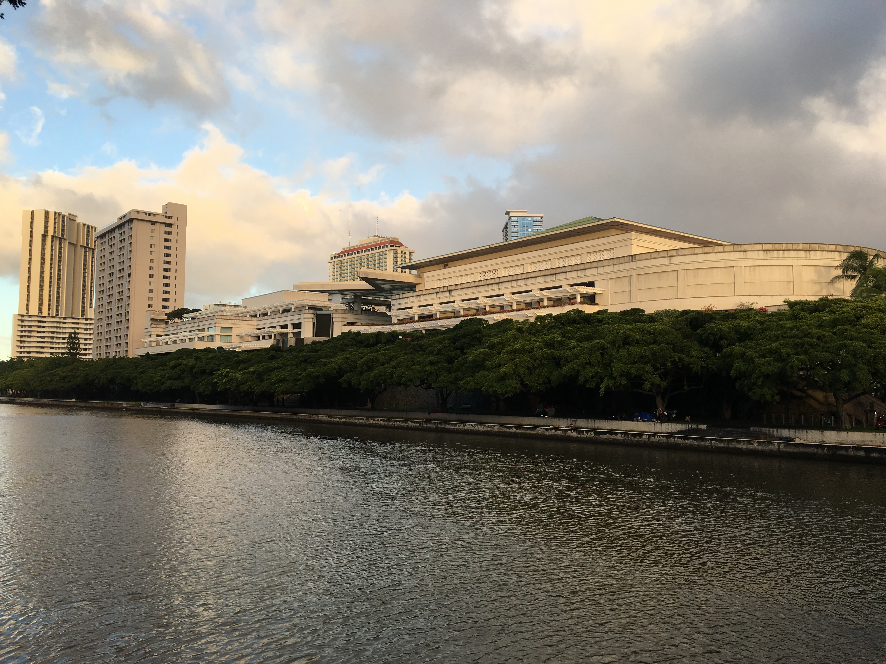
  
Hawaii Convention Center, where the AAS 235 meeting was held.

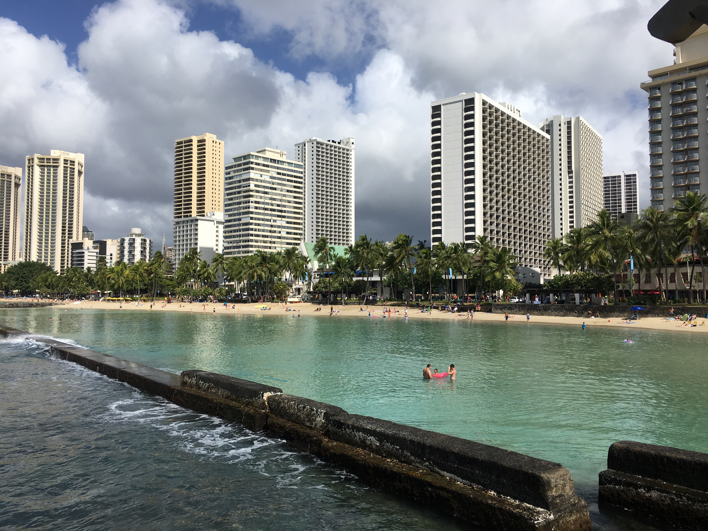
  
View of Waikiki beach.

  
Waikiki beach and the Kalakaua Avenue.

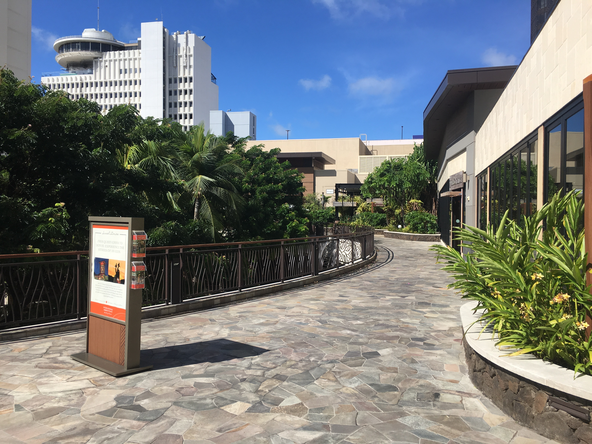
  
Top of the International Market Place, on Kalakaua Avenue.

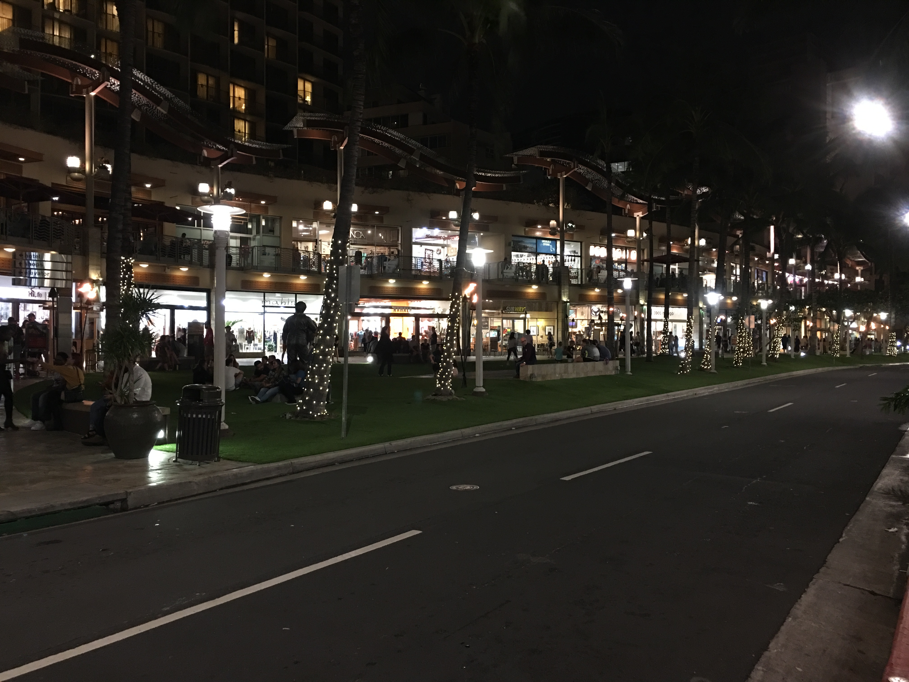
  
Night scene in Waikiki.

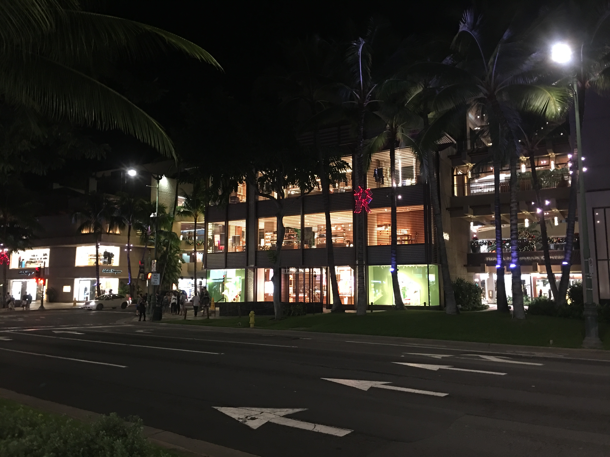
  
Night scene along the Kalakaua Avenue.

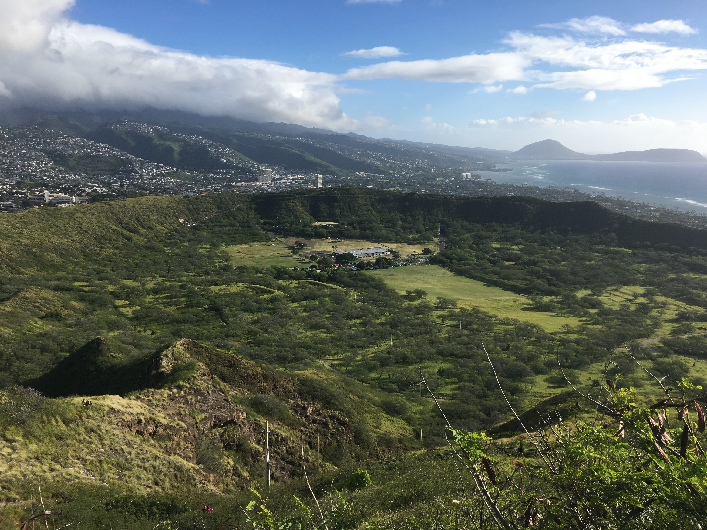
  
View of Diamond Head (volcanic cone) near the top.

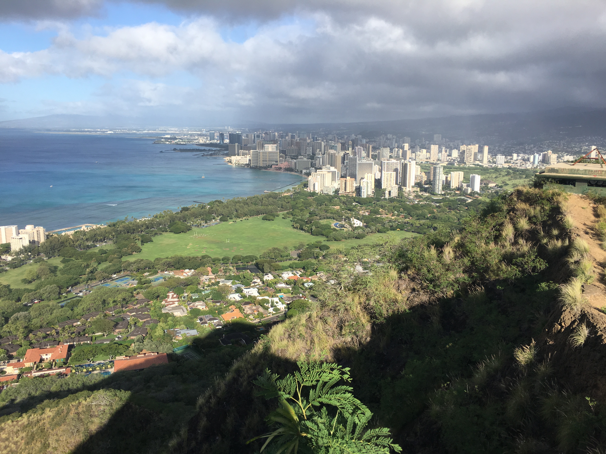
  
View of Waikiki at the top of Diamond Head.

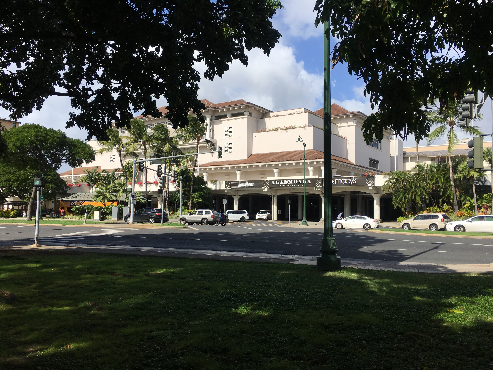
  
Ala Moana Center (largest shopping mall in Hawaii).

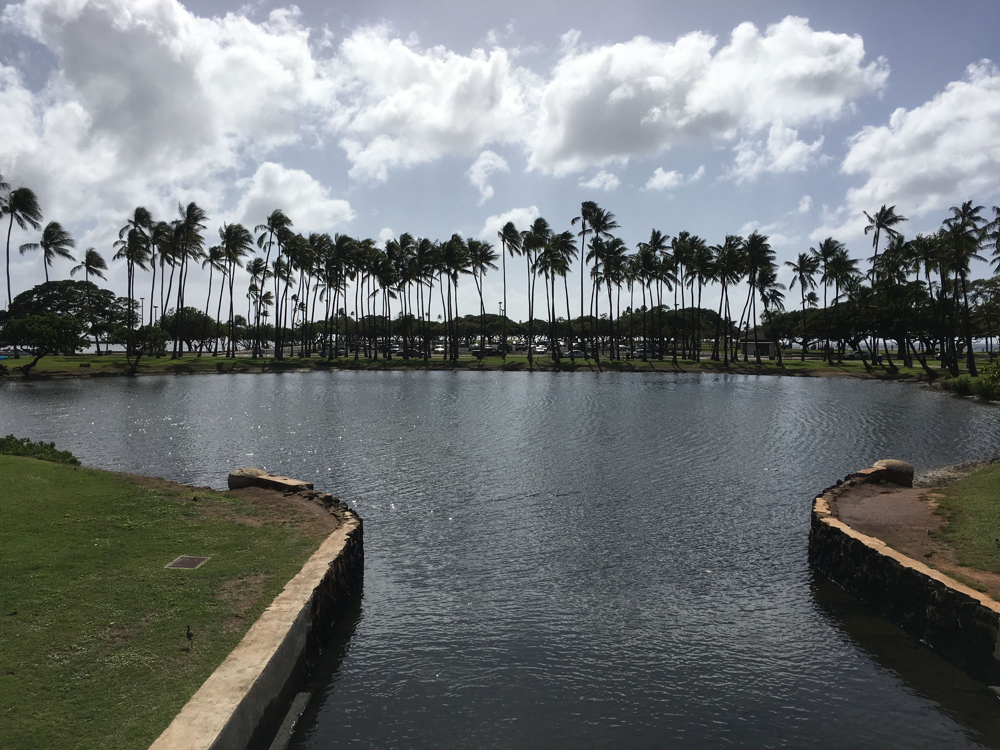
  
Palm trees along Ala Moana, near the beach.

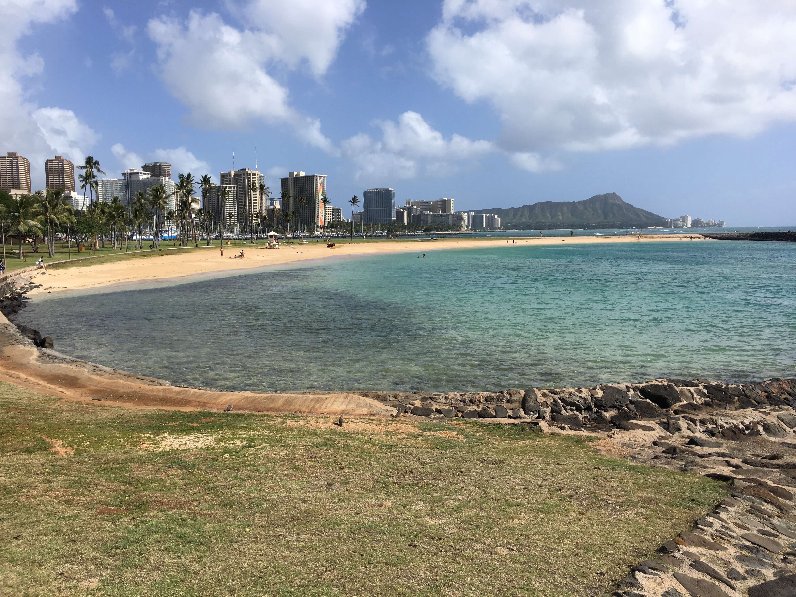
  

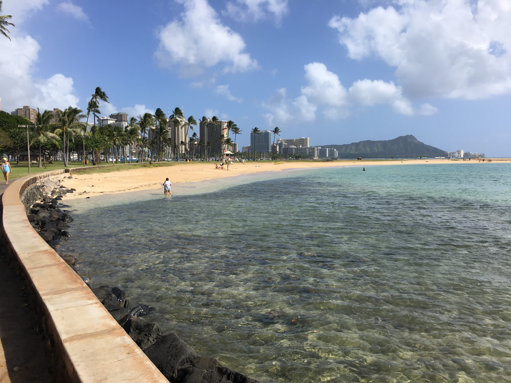
  
Views along Ala Moana beach, towards Waikiki.

