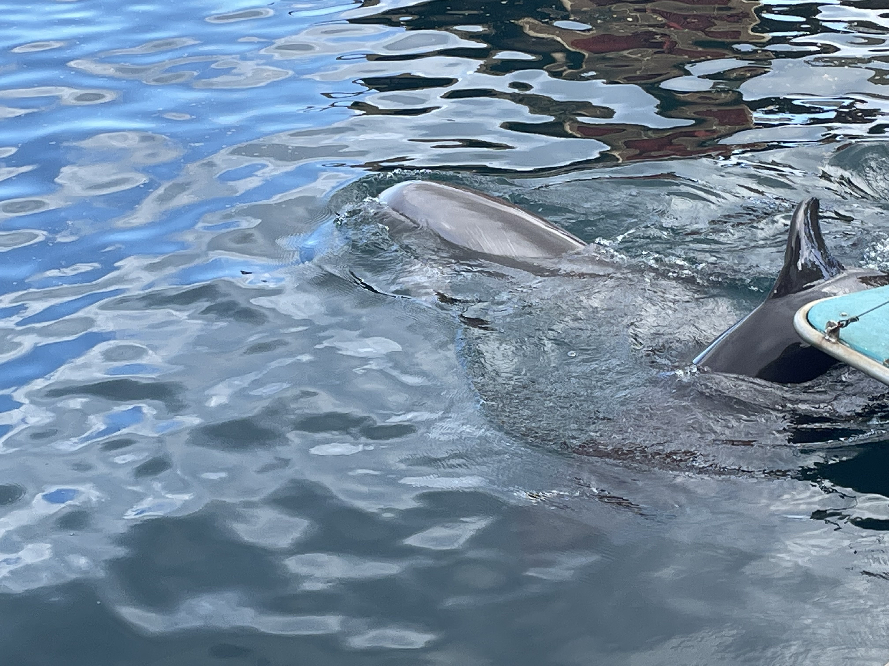

# Hawaii (Part 1: Oahu)

## December 20-26, 2022

Jump to:

- [Waikiki and Ala Moana](#waikiki)
- [Sea Life Park and the Ka Moana Lu'au](#sea-life-park)
- [Kualoa Ranch](#kualoa-ranch)
- [Pearl Harbor and Iolani Palace](#pearl-harbor-downtown)
- [Diamond Head](#diamond-head)

---

### Familiar views in Waikiki and Ala Moana {#waikiki}

  

  

  

  

  

  

  

  

  

---

### Sea Life Park and the Ka Moana Lu'au {#sea-life-park}

  
View inland at the Sea Life Park.

  
Map of Sea Life Park, where the Ka Moana Lu'au was held (bottom right corner).

  
Small sharks and other fish.

  
A pair of sea turtles, after feeding!

  
View of the dolphins exhibit.

  
Dolphins before their show!

  
View of the coast outside Sea Life Park.

---

### Kualoa Ranch, a movie-maker's paradise {#kualoa-ranch}

  
View near the entrance to Kualoa Ranch.

  
Parking lot and entrance to Kualoa Ranch.

  
Kualoa Ranch is home to many of the landscapes seen in the Jurassic Park movies.

  
Busses for the Kualoa Ranch tours.

  

  
Insane views on the tour, between the starting point and the main valley.

  

  
A model fossil/bone-yard for iconic movie scenes.

  
View of "Jurassic Valley".

---

### Pearl Harbor and Iolani Palace {#pearl-harbor-downtown}

  

  

  
Pearl Harbor National Memorial.

  

  
Iolani Palace.

  
Mele Kalikimaka!

---

### Revisiting Diamond Head -- at sunrise! {#diamond-head}

  

  
Sunrise at Diamond Head!

  

  

  

  
Views along the hike on Diamond Head.
