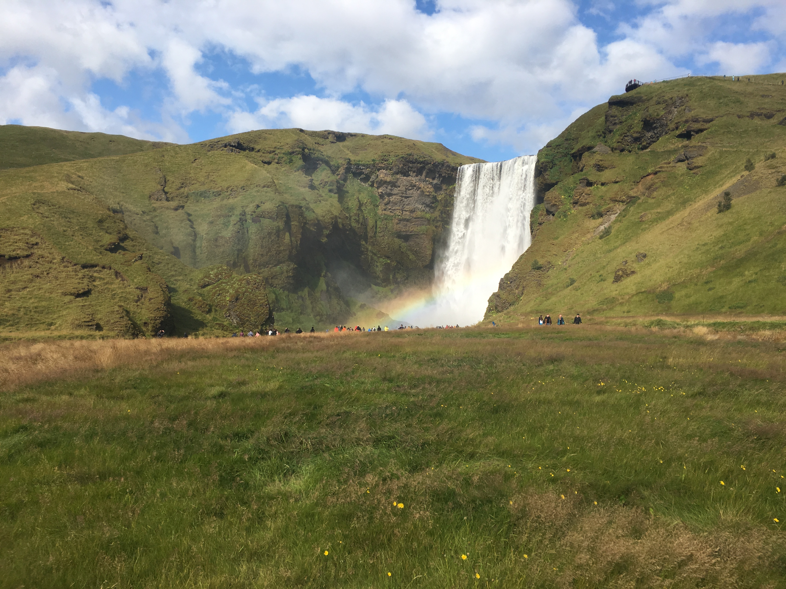
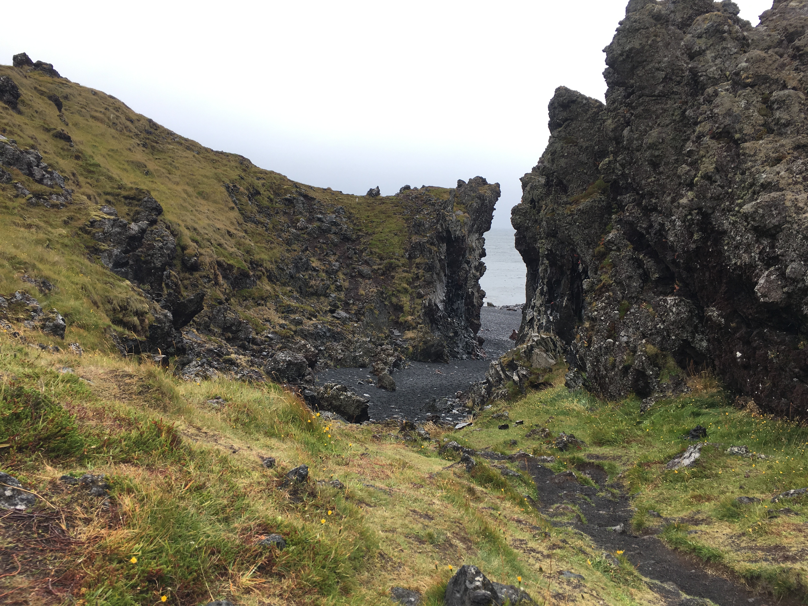

# Iceland

## August 18-28, 2019

  
Harpa Concert Hall and Conference Centre, where ExSS4 was held.

  
Me giving a talk at ExSS4, to an audience of around 600 exoplanet astrophysicists.

  
View of Reykjavik after a fancy dinner atop the Perlan restaurant and museum.

  
A tour through Thingvellir, during the mid-conference excursion.

  
Mars analog plains with a distant glacier.

  
Volcanic remains with waterfalls.

  
View of one of the few remaining glaciers.

  
Arrival at a black sand beach.

  
Black sand beach, with intriguing rock formations.

  
Incredible view on a hill atop the small town of Vik.

  
Skogafoss waterfall with a rainbow.

  
View from the top of Skogafoss.

  
A large rock with small caves and buildings.

  
Seljalandfoss waterfall, with a trail that goes behind the waterfall.

  
View from behind Seljalandfoss.

  
Side view of Seljalandfoss.

  
The most photographed view in Iceland.

  
Stairs to the top of a volcano, on an extremely windy day.

  
View from the top of a volcano, peering inside.

  
Corridor to a black sand beach in Snaefellsnes, the north-west corner of Iceland.

   
Coastal views in Snaefellsnes.

  
A hole along the coast of Snaefellsnes, with an arch.
