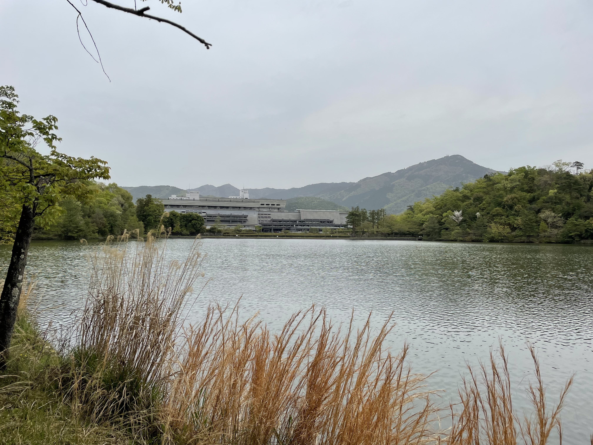

# Japan (Kyoto)

## April 8-18, 2023

Jump to:

- [The Prince Kyoto Takaragaike Hotel and the Kyoto International Conference Center](#hotel-venue)
- [Fushimi Inari Taisha](#fushimi-inari-taisha)
- [Downtown Kyoto](#downtown-kyoto)
- [Kiyomizu-Dera Temple](#kiyomizu-dera)
- [Nijo Castle](#nijo-castle)

---

### The Prince Kyoto Takaragaike Hotel and the Kyoto International Conference Center {#hotel-venue}

  
The Prince Kyoto Takaragaike Hotel, *Autograph Collection*.

  

  
Street views between the hotel (left side) and the conference venue (right side).

  
The "Event Hall" of the Kyoto International Conference Center.

  
View of the hotel from the conference venue.

  
Swan pond behind the conference venue.

  
Main building of the conference center.

  
View of the conference center from a park across the lake.

---

### Fushimi Inari Taisha {#fushimi-inari-taisha}

  
Entrance area to the Fushimi Inari Taisha.

  

  
Iconic rows of orange gates. The engraved words are only visible while looking backwards (downhill).

---

### Various streets in downtown Kyoto {#downtown-kyoto}

  

  
Two of many streets in downtown. Mountains are visible in the background.

  
An intersection near the edge of downtown, with mountains nearby in the background.

  
A major road going across downtown.

  
A downtown small river at night.

  
Train tracks at the Kyoto Station.

  
Stairs leading to restaurants above the Kyoto Station.

  
View of the Kyoto tower at night.

---

### Kamogawa (Kamo River) and Kiyomizu-Dera Temple {#kiyomizu-dera}

  

  
Views along Kamogawa, towards the north direction. The river separates downtown from the mountains on the east side, where many of the temples lie (including Fushimi Inari Taisha and Kiyomizu-Dera).

  

  
Views of downtown from Kiyomizu-Dera.

  

  
Views of the main temple at Kiyomizu-Dera.

  

  
Stone streets and shops near Kiyomizu-Dera.

---

### Nijo Castle and cherry blossoms {#nijo-castle}

  
Golden gates entering Nijo Castle.

  
Pond in Nijo Castle.

  
View of the inner moat surrounding Nijo Castle, from atop a keep tower.

  
Close-up of cherry blossoms.

---
