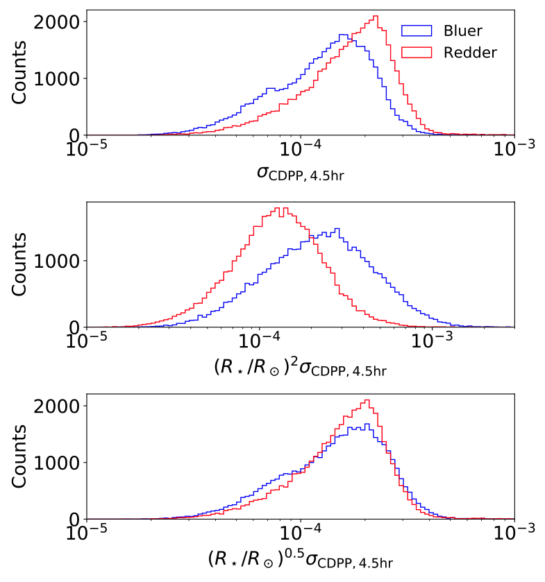

# Occurrence and architectures of planetary systems as a function of stellar type

*Do all stars have planets? Are planets more common around some types of stars than others? How do the planetary orbits vary with the host star properties?*

These are the main questions we address in our second paper of the "Architectures of Exoplanetary Systems" series: [He, Ford, & Ragozzine (2020a)](https://arxiv.org/abs/2003.04348).

This work builds on the work in our previous paper, [He, Ford, & Ragozzine (2019)](https://arxiv.org/abs/1907.07773) (which we will refer to as Paper I), where we developed several models for the intrinsic architectures of planetary systems by forward modelling the Kepler catalog of planet candidates. See this [page](https://hematthi.github.io/research/syssim_architectures.html) for a high-level summary of our methods and results. In that paper, we showed that our forward modelling framework allows us to infer many things about the way planets are distributed between and across stars. However, we also assumed that the distribution of planetary systems was the same across all stars. While this assumption allows us to characterize the distribution of planetary systems across all the stars as a whole, it turns out that the data also allows us to explore how the distribution may change as a function of the types of stars hosting them!

  
*Artist's depiction of the many types of planets that exist, similar to those that Kepler discovered. Image credit: NASA MSFC*

### Spectral classification of stellar types

To measure how the occurrence of planets might change with stellar (spectral) type, we first need a large sample of planets around a large sample of stars across a wide range of spectral types. This is exactly what Kepler provided; not only did the mission yield several thousand exoplanet candidates, but it detected these planets around main sequence stars spanning a wide range of temperatures.

Stars are typically classified based on their effective temperatures, with the terms "early" meaning hotter temperatures and "late" meaning cooler temperatures. Kepler found planets around mainly F, G, K, and M dwarf stars, which span effective temperatures from ~7000K to below ~4000K. For comparison, our Sun is a G2 dwarf with an effective temperature of about 5780K. Earlier type (hotter) stars tend to be larger and more massive than later type (cooler) stars. (More massive stars are also much shorter-lived, because they burn up their energy at a much faster rate, and as a result they are far less common!)

Unfortunately, the effective temperatures, masses, and radii of stars are rather difficult to measure precisely, and require a good deal of stellar modelling. One way in which astronomers can more quickly classify stars is to measure their *colors*, which simply involves measuring the magnitudes of the stars in two or more wavelength bands and subtracting them. This works because hotter objects emit more energy at shorter wavelengths, and thus appear *bluer* than cooler objects which are *redder*. However, the measured colors also need to be corrected for *differential reddening* caused by *extinction* due to interstellar dust and material. This is done by subtracting a term from the color for how much bluer the star should be compared to what we see, which is typically estimated by how far the star is from us and how much dust we expect to be along the line of sight. The figure below shows the strong correlation between the stellar effective temperatures and the (reddening-corrected) bp-rp colors measured from the Gaia mission, for the sample of Kepler FGK dwarf stars used in our studies. We use the Gaia colors as a proxy for spectral type in this analysis.

  
*Figure 2 in He, Ford, & Ragozzine (2020a). Stellar effective temperature versus Gaia (reddening-corrected) color relation for Kepler's FGK dwarfs. Hotter stars are bluer (lower bp-rp-E), while cooler stars are redder (higher bp-rp-E).*

### Kepler sensitivity to transiting planets

Figuring out the true occurrence of planets as a function of stellar type is complicated because not only do different types of stars potentially host different numbers (and types) of planets, but they also have different detection limits which affects how many planets we can see around each star!

Several properties of the stars affect the detectability of planets around them using the transit method.
* First, a planet must transit at all in order to have any chance at being detected by transit surveys! This is a function of the size of the star: larger stars are more likely to cause transits simply due to the chance that the planet's orbit passes in front of the star along our line of sight (this is commonly referred to as the "geometric transit probability", which is proportional to the stellar radius).
* Given a transiting planet, how likely we are to detect a transit depends on its signal to noise ratio (SNR). The signal is the transit depth times the square root of the duration, while the noise is the photometric variability of the light curve.
* To first approximation, the transit depth of a planet is simply a geometric effect: the planet blocks out a small fraction of the total light coming from the star during its transit. The transit depth is inversely proportional to the stellar radius squared. Thus for a given sized planet, it would induce a larger transit depth if it were transiting a smaller, cooler star than a larger, hotter star.
* However, larger stars also induce longer transit durations, due to the distance a planet must travel in order to cross the stellar disk.
* Finally, cooler stars are typically fainter and thus Kepler's photometric precision of these targets is worse than that of hotter stars (i.e. the light curves are noisier).
All of these factors must be simultaneously accounted for in order to compute the detection efficiency of planets around each star.

  
*Figure 8 in He, Ford, & Ragozzine (2020a). Planets transiting cooler (redder) stars induce a larger transit depth due to the smaller sizes of the stars, but Kepler's photometry of these stars is noisier (quantified by the root-mean-square CDPP values) thus compromising our ability to recover transits.*

### The fraction of stars with planets

Several previous studies have already used the Kepler data to show that the occurrence of planets varies across stars of different spectral types. These studies generally suggest that the types of planets that Kepler found (mostly rocky, super-Earth to sub-Neptune sized planets with periods less than a year) are more common around later type, or redder, stars than earlier type stars. However, these studies typically did not differentiate between the fraction of stars with planets, and the rate of planets per star - two related but different measures for how common planets are! This is due to a degeneracy between these two measures that cannot be resolved by only counting the total numbers of planets and stars - for example, every star having exactly one planet yields the same overall rate of planets per star as an alternate scenario where half of the stars have two planets each and the other half has no planets!

However, by fitting to the relative fractions of observed single and multi-planet systems, our models also constrain the underlying multiplicity distribution. This allows us to break the above degeneracy, and constrain both the fraction of stars with planets as well as the mean number of planets per star. To test for potential differences in planet occurrence with stellar type, we introduce a linear dependence for the fraction of stars with planets (fswpa, in our chosen period range of 3 to 300 days) as a function of the stellar (bp-rp-E) color, into our clustered models. We fit these two additional parameters (the slope and normalization constant for this linear function) simultaneously with all the other parameters of the model using the same method as in Paper I.

We find that the fraction of stars with planets increases significantly from early to late type stars, even across the FGK range (top half of the figure below). In other words, the occurrence of planetary *systems*, not just of planets, increases towards redder stars. Our results indicate that roughly a third of early F dwarfs host a planetary system while this fraction increases to 100% for mid K dwarfs. For reference, our Sun is a G2V star with bp-rp = 0.82. Thus, our results show that roughly half of all Sun-like stars host a planetary system in the range we considered (between 3 and 300 days).

  
*Figure 4 in He, Ford, & Ragozzine (2020a). The fraction of stars with planets (fswpa; between 3 and 300 days) increases from bluer (hotter) stars to redder (cooler) stars (upper half panel). However, an alternative model in which the period power-law distribution of planets changes with spectral type also appears to provide a similar explanation, if the fraction of stars with planets is held as a constant (bottom half panel).*

### Alternative explanations?

We also considered several alternative models, including one in which the *orbital period distribution* of the planets changes with spectral type. By parametrizing the period power-law index (αP) as a linear function of the color (bottom half of the figure above), we find that this can also yield more detected planets around redder stars than bluer stars, if the period distribution is more negatively sloped for redder stars. This can be easily understood by considering how the detectability of planets via transits diminuishes greatly with increasing periods: a more negative value of αP means that more planets are at shorter periods, which are more likely to transit and easier to detect.

However, we find that this trend only appears if we hold the fraction of stars with planets as a constant across all spectral types, but disappears when we *simultaneously* model both fswpa and αP as functions of color. In either case, the strong increase in fswpa towards redder stars persists. Thus, this is our preferred model for explaining how the rates of planets varies with spectral types of their host stars!

  
*Cartoon illustrating the main results of this paper.*
