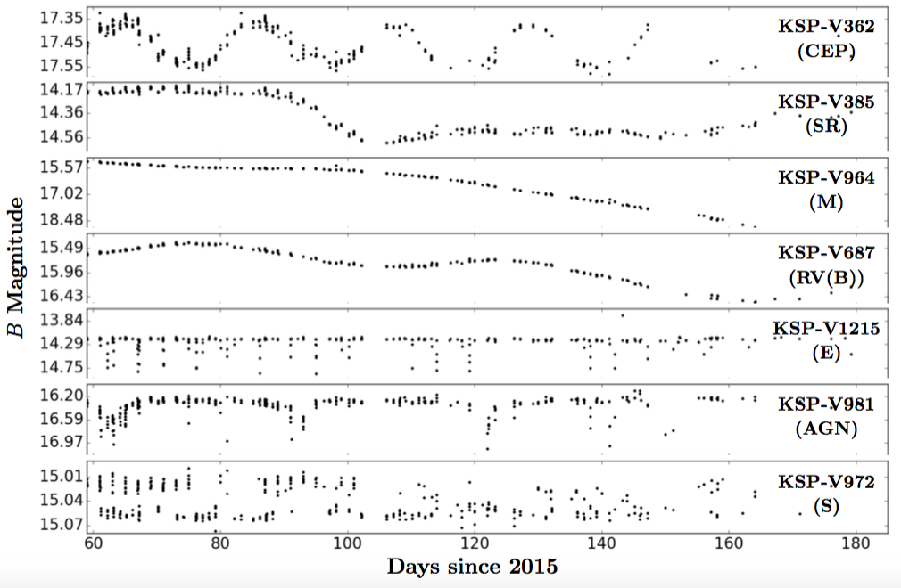

# Characterizing variable stars with time series analysis

For my undergraduate honors thesis, I worked under the guidance of Prof. Dae-Sik Moon on one of his data-driven projects. As part of his collaboration in the Korea Microlensing Telescope Network (KMTNet), we had obtained a large collection of wide-field, multi-wavelength astronomical images spanning several months. Focusing on one subset of the data, my job was to analyze over ten thousand light curves in order to pick out all the variable stars and other interesting objects/transients. Weeding through thousands of false positives, I was able to reduce the data to a sample of ~1250 objects with variable light curves, as well as characterize and classify them based on their properties including magnitude, color, periodicity, etc.

Although variable stars have been studied for many decades, there is such a rich variety of different types of variable stars that some of them are still not fully understood, and our knowledge of them is often derived from only a few case studies. Thus, my work in this project expanded the existing catalogues of variable stars and serves as a reference for future follow-up studies. Our sample of objects and their properties are described in a published paper derived from my undergraduate thesis, [He et al. (2016)](http://jkas.kas.org/journals/2016v49n5/v49n5p209_mattias.pdf).

  
*Figure 7 in He et al. (2016). The light curves of a sample of variable objects in our dataset.*
